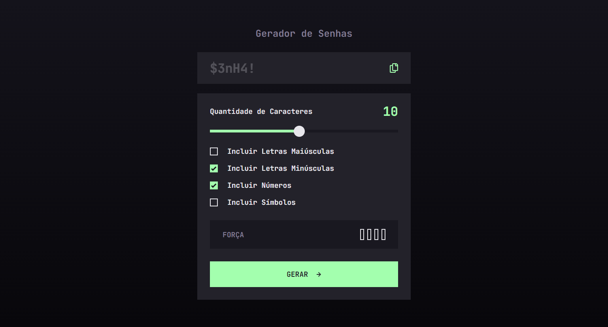

# Gerador de Senhas

## Objetivo

O usuário deve ser capaz de:

- Gerar uma senha baseada em opções selecionáveis
- Copiar a senha para a área de tranferência do computador
- Visualizar uma avaliação para a senha gerada
- Visualizar de forma otimizada o layout para a interface, independente do tamanho da tela do dispositivo
- Visualizar os estados de foco para todos os elementos interativos na página

### Links

- [Live Site](https://randpass-fm.netlify.app/)

### Desenvolvido com:

- HTML5
- CSS custom properties
- Javascript
- Desktop-first workflow

## Autor

@gio.schardong
